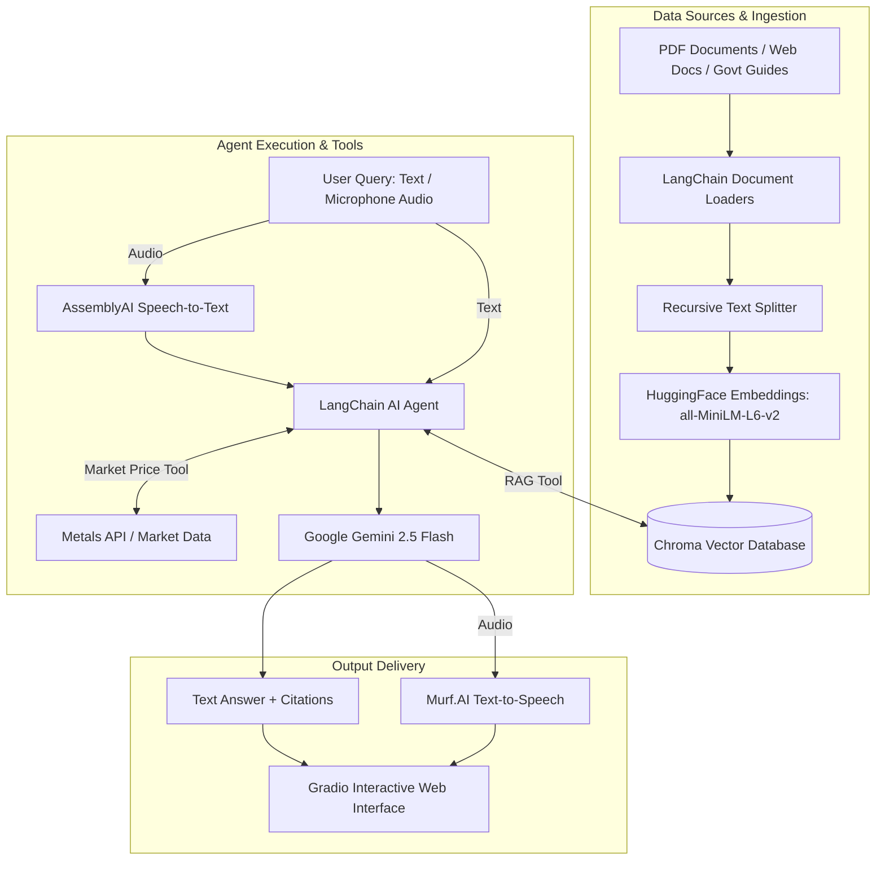

# RAG Agents & AI Advisors 🤖📚

A collection of Retrieval-Augmented Generation (RAG) agents and autonomous AI advisors built with **LangChain**, **HuggingFace Embeddings**, **Chroma Vector Database**, **Google Gemini** (`gemini-2.5-flash`), **AssemblyAI**, **Murf.AI**, and **Gradio**.

This repository contains notebook implementations for PDF question-answering, live web documentation Q&A, and a voice-enabled personal finance advisor tailored for Indian citizens.

---

## 🌟 Overview & Architecture

These agents leverage RAG pipelines and tool-calling agent architectures to prevent hallucinations and deliver accurate, context-aware answers with source citations.



---

## 🤖 What the Agents Do

| Notebook | Agent Role & Description | Ingestion Source | Core Tools / Features | Output Interface |
| :--- | :--- | :--- | :--- | :--- |
| **`Personal_finance_advicer.ipynb`** | **Voice-Enabled Personal Finance Advisor** <br> Answers questions regarding Indian tax rules, GST rates, financial education, and live gold/silver prices. | Official Indian Govt PDFs (SEBI, CBIC GST) & Live APIs | `search_finance_docs` (Chroma RAG), `get_market_price` (Gold/Silver API), AssemblyAI (STT), Murf.AI (TTS) | Interactive Gradio Web UI with Voice & Text support |
| **`RAG.ipynb`** | **PDF Document RAG Agent** <br> Contextual Q&A agent grounded strictly in research papers or custom PDFs (e.g., *Attention Is All You Need*). | Local or Google Drive PDF files | `PyPDFLoader`, `RecursiveCharacterTextSplitter`, Similarity Search ($k=2$) | Text responses with document metadata |
| **`docuchat_with_webdocs (3).ipynb`** | **Web Documentation RAG Agent** <br> Crawls, indexes, and answers technical inquiries from live developer documentation pages. | Web URLs via `WebBaseLoader` (`BeautifulSoup4`) | Web scraping, Chroma indexing ($k=6$), grounded prompt constraint | Markdown formatted text responses |

---

## 📁 Repository Structure

```text
RAG-Agents/
├── Personal_finance_advicer.ipynb  # Voice-enabled Personal Finance AI Advisor
├── RAG.ipynb                       # PDF Document RAG Agent
├── docuchat_with_webdocs (3).ipynb # Web Documentation RAG Agent
└── README.md                       # Documentation & setup guide
```

---

## 🎓 Prerequisite Knowledge

Before running or modifying these agents, familiarizing yourself with the following concepts is recommended:

- **Python Basics**: Functions, API interactions, environment variable handling.
- **RAG Fundamentals**: Document chunking (`chunk_size`, `chunk_overlap`), text embeddings, vector similarity search, and prompt engineering.
- **LangChain Ecosystem**:
  - Loaders: `PyPDFLoader`, `WebBaseLoader`
  - Text Splitters: `RecursiveCharacterTextSplitter`
  - Embeddings & Vector Stores: `HuggingFaceEmbeddings`, `Chroma`
  - Tools & Agents: `@tool` decorator, `create_agent`, `init_chat_model`
- **Speech Technologies**: Speech-to-Text (AssemblyAI) and Text-to-Speech (Murf.AI Falcon model).
- **Web UI**: Building interactive interfaces using `Gradio`.

---

## 🚀 Setup & Execution Guide (Google Colab)

These notebooks are optimized for **Google Colab**.

### Step 1: Set Up API Keys in Colab Secrets
Click on the **Secrets** (🔑 icon) on the left sidebar in Google Colab and add the following keys:

| Secret Name | Purpose | Where to Get | Required For |
| :--- | :--- | :--- | :--- |
| `gemini_api_key` | Google Gemini LLM access | [Google AI Studio](https://aistudio.google.com/) | All notebooks |
| `ASSEMBLYAI_API_KEY` | Voice-to-Text Transcription | [AssemblyAI Dashboard](https://www.assemblyai.com/) | `Personal_finance_advicer.ipynb` |
| `MURF_API_KEY` | Text-to-Voice Synthesis | [Murf.AI API Portal](https://murf.ai/) | `Personal_finance_advicer.ipynb` |

*Ensure **Notebook access** is toggled ON for each added secret.*

### Step 2: Execute Notebooks
1. Open any notebook in Colab.
2. Run cells sequentially to install dependencies, load data, build Chroma DB, and launch the Gradio UI.

---

## 🐍 Running as Python (`.py`) Scripts: Key Modifications

If you convert these notebooks into standard Python scripts (`.py`), you do **not** need to change the core RAG or agent logic. You only need to adjust environment setup and UI launchers.

Here are the key parts to modify:

### 1. Remove Notebook Shell Commands
Remove all notebook magic commands (e.g., `!pip install ...`) and manage dependencies via `requirements.txt`:
```bash
pip install langchain langchain-community langchain-huggingface langchain-chroma langchain-google-genai sentence-transformers pypdf beautifulsoup4 gradio assemblyai python-dotenv requests
```

### 2. Replace Colab Secrets with `python-dotenv`
In notebook code, keys are retrieved via `google.colab.userdata`. In `.py` scripts, use `os.getenv` with a `.env` file:

**Colab Code**:
```python
from google.colab import userdata
api_key = userdata.get('gemini_api_key')
```

**Python Script Change**:
```python
import os
from dotenv import load_dotenv

load_dotenv()
api_key = os.getenv("GEMINI_API_KEY")
assemblyai_key = os.getenv("ASSEMBLYAI_API_KEY")
murf_key = os.getenv("MURF_API_KEY")
```

### 3. Replace Hardcoded Google Drive Paths
Change `/content/drive/MyDrive/...` paths to local relative directory paths (e.g., `./data/sample.pdf`).

### 4. Remove IPython Display Statements
Replace Jupyter `display(Markdown(...))` calls with standard Python `print()` statements.

### 5. Adjust Gradio Launch Call
In standalone scripts, wrap your main execution inside `if __name__ == "__main__":`:

```python
if __name__ == "__main__":
    demo.launch()  # Remove share=True or set server_name="0.0.0.0" if hosting on a server
```

---

## 📜 Dependencies Summary

- **LLM & Agents**: `langchain`, `langchain-google-genai`
- **Document Processing**: `pypdf`, `beautifulsoup4`, `langchain-text-splitters`
- **Embeddings & Database**: `sentence-transformers`, `langchain-huggingface`, `langchain-chroma`
- **Voice & Audio**: `assemblyai`, `requests` (for Murf.AI TTS API)
- **UI Framework**: `gradio`

---

## 🤝 Contributing

Pull requests, issues, and suggestions are welcome! Feel free to fork the repository and submit your contributions.
