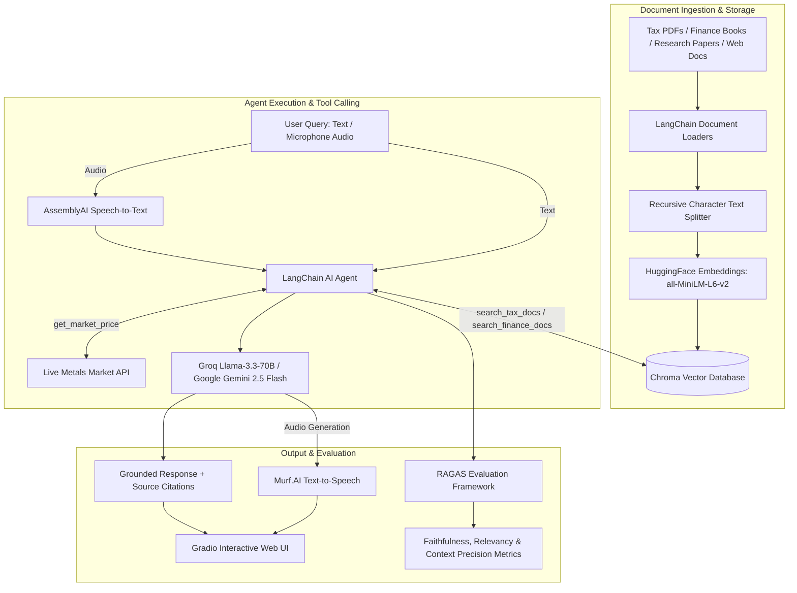

# RAG Agents & AI Advisors 🤖📚

A collection of Retrieval-Augmented Generation (RAG) AI agents and autonomous advisors built with **LangChain**, **HuggingFace Embeddings**, **Chroma Vector Database**, **Groq** (`llama-3.3-70b-versatile`), **Google Gemini** (`gemini-2.5-flash`), **AssemblyAI**, **Murf.AI**, **Gradio**, and **RAGAS Evaluation Framework**.

This repository contains intelligent assistants for Indian Personal Income Tax advising, Indian Personal Finance & market data consulting, PDF research paper Q&A, and live web documentation analysis.

---

## 🌟 Overview & Architecture

These agents combine RAG document ingestion, multi-provider LLM reasoning (Groq & Gemini), custom tools, voice interaction, and automated RAG evaluation metrics.



---

## 🤖 What the Agents Do

| Agent / Notebook | Primary Function | Data / Ingestion Source | Core Tools & Models | UI & Evaluation |
| :--- | :--- | :--- | :--- | :--- |
| **`Personal tax Advisor/Personal_Tax_AI_Advisor.ipynb`** | **Personal AI Tax Advisor for Indian Citizens** <br> Answers complex tax queries (Old vs. New Tax Regime, Section 80C/80D deductions, ITR form selection ITR-1 to 7, filing rules, penalties). | CBDT ITR-4 Validation Rules, CBDT FAQ PDFs, SEBI Booklet | `search_tax_docs` tool, **Groq Llama-3.3-70B** (`llama-3.3-70b-versatile`) | Gradio Web UI + RAGAS Metric Suite |
| **`Personal_finance_advicer (5).ipynb`** | **Voice-Enabled Personal Finance Advisor** <br> Financial guidance on GST rates, savings options, and live gold/silver prices in INR with voice input and audio response generation. | SEBI Financial Booklet, CBIC GST Ready Reckoner, Live Metals API | `search_finance_docs`, `get_market_price`, **Gemini 2.5 Flash**, AssemblyAI (STT), Murf.AI (TTS) | Gradio Voice & Text UI + RAGAS Metric Suite |
| **`RAG.ipynb`** | **PDF Document RAG Agent** <br> Performs grounded Q&A over research papers (e.g., *Attention Is All You Need* paper) with exact metadata citations. | PDF files via `PyPDFLoader` | `similarity_search` ($k=2$), **Gemini 2.5 Flash** | Python text output with source citations |
| **`docuchat_with_webdocs (3).ipynb`** | **Web Documentation RAG Agent** <br> Crawls, chunks, and answers technical inquiries directly from live developer documentation pages. | Web URLs via `WebBaseLoader` (`BeautifulSoup4`) | Chroma indexing ($k=6$), **Gemini 2.5 Flash** | Formatted Markdown outputs |

---

## 📊 Automated Evaluation (RAGAS Framework)

Both advisor notebooks feature quantitative RAG evaluation using the **RAGAS** framework:

- **Faithfulness**: Verifies that generated answers are grounded entirely in retrieved PDF context without hallucinations.
- **Answer Relevancy**: Evaluates how directly the answer addresses the user query.
- **Context Precision**: Measures the signal-to-noise ratio in retrieved context chunks.
- **Context Recall**: Verifies if all ground-truth context needed for answering was successfully retrieved.

---

## 📁 Repository Structure

```text
RAG-Agents/
├── Personal tax Advisor/
│   ├── CBDT_e-Filing_ITR 4_Validation Rules_AY 2026-27.pdf
│   ├── Common ITR Filing FAQs AY 2024-25.pdf
│   ├── Financial Education Booklet - English.pdf
│   ├── ITR-7_FAQ_AY_2024-25.pdf
│   ├── New vs. Old Regime FAQs approved final.pdf
│   └── Personal_Tax_AI_Advisor.ipynb      # Groq-powered Indian Tax AI Advisor
├── Personal_finance_advicer (5).ipynb       # Voice Finance Advisor + RAGAS
├── RAG.ipynb                                # Research Paper PDF RAG Agent
├── docuchat_with_webdocs (3).ipynb          # Web Documentation RAG Agent
└── README.md                                # Repository documentation
```

---

## 🎓 Prerequisite Knowledge

- **Domain Knowledge**: Indian Income Tax Regimes (Old vs New), Section 80C/80D/80TTA deductions, ITR form types (ITR-1 to 7), GST rates, and financial asset pricing.
- **RAG & Vector Search**: Recursive text chunking, dense vector embeddings (`all-MiniLM-L6-v2`), and Chroma vector database management.
- **LLMs & Agent Tooling**:
  - `langchain-groq` (`llama-3.3-70b-versatile`) & `langchain-google-genai` (`gemini-2.5-flash`)
  - LangChain `@tool` decorator, `create_agent`, and `init_chat_model`
- **Voice APIs**: Speech-to-Text (AssemblyAI) and Text-to-Speech (Murf.AI Falcon model).
- **RAG Evaluation**: RAGAS metrics (`ragas.llms.LangchainLLMWrapper`).

---

## 🚀 Setup & Execution Guide (Google Colab)

These notebooks are designed to run in **Google Colab**.

### Step 1: Set Up Secrets in Google Colab
Open Colab's **Secrets** panel (🔑 icon on the left toolbar) and add:

| Secret Name | Purpose | Where to Get | Required Notebook |
| :--- | :--- | :--- | :--- |
| `GROQ_API_KEY` | Groq LLM inference (`llama-3.3-70b`) | [Groq Console](https://console.groq.com/) | `Personal_Tax_AI_Advisor.ipynb` |
| `gemini_api_key` | Google Gemini LLM access | [Google AI Studio](https://aistudio.google.com/) | All notebooks |
| `ASSEMBLYAI_API_KEY` | Speech-to-Text transcription | [AssemblyAI Dashboard](https://www.assemblyai.com/) | `Personal_finance_advicer (5).ipynb` |
| `MURF_API_KEY` | Text-to-Speech audio synthesis | [Murf.AI API Portal](https://murf.ai/) | `Personal_finance_advicer (5).ipynb` |

*Make sure **Notebook access** is enabled for all added secrets.*

### Step 2: Run Notebooks
Execute notebook cells sequentially to install dependencies, load PDFs, initialize Chroma vector stores, run agent queries, launch Gradio interfaces, and execute RAGAS evaluations.

---

## 🐍 Running as Python (`.py`) Scripts: Key Modifications

To execute these notebooks as standard Python scripts (`.py`), make the following minimal code adjustments:

### 1. Dependency Installation
Remove `!pip install` lines and install required packages in your environment:
```bash
pip install langchain langchain-community langchain-huggingface langchain-chroma langchain-groq langchain-google-genai sentence-transformers pypdf beautifulsoup4 gradio assemblyai ragas python-dotenv requests
```

### 2. Environment Variable Management
Replace `google.colab.userdata` with `python-dotenv` and `os.getenv`:

```python
import os
from dotenv import load_dotenv

load_dotenv()
groq_api_key = os.getenv("GROQ_API_KEY")
gemini_api_key = os.getenv("GEMINI_API_KEY")
assemblyai_key = os.getenv("ASSEMBLYAI_API_KEY")
murf_key = os.getenv("MURF_API_KEY")
```

### 3. Path & Output Adjustments
- Update Colab paths (e.g. `/content/drive/MyDrive/...`) to relative local paths (e.g. `./Personal tax Advisor/CBDT_e-Filing...pdf`).
- Replace `display(Markdown(...))` calls with standard `print()` functions.

### 4. CLI / Gradio Entry Point
Wrap script execution inside `if __name__ == "__main__":`:

```python
if __name__ == "__main__":
    demo.launch()
```

---

## 📜 Dependencies Summary

- **LLMs & Agents**: `langchain`, `langchain-groq`, `langchain-google-genai`
- **Document Processing**: `pypdf`, `beautifulsoup4`, `langchain-text-splitters`
- **Vector Database & Embeddings**: `sentence-transformers`, `langchain-huggingface`, `langchain-chroma`
- **Voice & Audio**: `assemblyai`, `requests` (Murf.AI API)
- **Evaluation**: `ragas`
- **Interface**: `gradio`

---

## 🤝 Contributing

Contributions, issues, and feature requests are welcome! Feel free to open an issue or submit a pull request.
