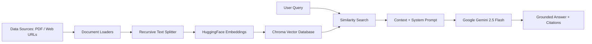

# RAG Agents 🤖📚

A collection of Retrieval-Augmented Generation (RAG) AI agents built using **LangChain**, **HuggingFace Embeddings**, **Chroma Vector Store**, and **Google Gemini** (`gemini-2.5-flash`).

These agents load, chunk, embed, index, and perform intelligent context-aware Question Answering (Q&A) over unstructured documents (PDFs) and live web documentation.

---

## 🌟 Overview & Architecture

Retrieval-Augmented Generation (RAG) enhances Large Language Models (LLMs) by connecting them to external data sources. This ensures precise, grounded responses with verifiable source citations, preventing AI hallucinations.



---

## 🤖 What the Agents Do

| Agent Notebook | Primary Function | Document Loader | Vector Store Collection | Default Retrieval Depth |
| :--- | :--- | :--- | :--- | :--- |
| **`RAG.ipynb`** | **PDF Document RAG Agent** <br> Answers questions grounded strictly in academic papers or local/Google Drive PDF files (e.g., the *Attention Is All You Need* paper). | `PyPDFLoader` | `NIPS-2017` | Top $k=2$ chunks |
| **`docuchat_with_webdocs (3).ipynb`** | **Web Documentation RAG Agent** <br> Crawls web documentation pages (e.g., LangChain docs), indexes content, and provides formatted answers for technical documentation inquiries. | `WebBaseLoader` (`BeautifulSoup4`) | `WebDocs` | Top $k=6$ chunks |

### Core Pipeline Components:
1. **Document Loading**: Ingests local/Google Drive PDFs using `PyPDFLoader` or live web pages via `WebBaseLoader`.
2. **Text Chunking**: Uses `RecursiveCharacterTextSplitter` with a chunk size of `1000` characters and `200` overlap to preserve context across boundaries.
3. **Embedding Generation**: Converts text chunks into dense vector representations using `sentence-transformers/all-MiniLM-L6-v2`.
4. **Vector Storage & Retrieval**: Stores embeddings locally in `ChromaDB` under `./chroma_langchain_db` and performs similarity search to retrieve relevant context.
5. **Grounded Generation**: Feeds query + retrieved context into Google Gemini (`google_genai:gemini-2.5-flash`) via `langchain.chat_models.init_chat_model`.

---

## 📁 Repository Structure

```text
RAG-Agents/
├── RAG.ipynb                        # Notebook: PDF Document RAG Agent
├── docuchat_with_webdocs (3).ipynb  # Notebook: Web Documentation RAG Agent
└── README.md                        # Documentation & setup guide
```

---

## 🎓 Prerequisite Knowledge

To understand and modify these RAG agents, familiarizing yourself with the following concepts is recommended:

- **Python Basics**: Functions, list manipulations, string formatting, environment management.
- **RAG Architecture**: Document chunking strategies, vector embeddings, cosine similarity search, and prompt engineering.
- **LangChain Ecosystem**:
  - `DocumentLoaders` (`PyPDFLoader`, `WebBaseLoader`)
  - `TextSplitters` (`RecursiveCharacterTextSplitter`)
  - `Embeddings` (`HuggingFaceEmbeddings`)
  - `VectorStores` (`Chroma`)
  - Chat Models (`init_chat_model`, `langchain-google-genai`)
- **API Keys**: Setting up and retrieving Google Gemini API keys.

---

## 🚀 Setup & Execution Guide (Google Colab)

The notebooks are pre-configured to run seamlessly in **Google Colab**.

### Step 1: Open Notebook in Google Colab
Upload `RAG.ipynb` or `docuchat_with_webdocs (3).ipynb` to Google Colab.

### Step 2: Set Up Gemini API Key Secrets
1. Go to **Secrets** (🔑 key icon on the left panel in Google Colab).
2. Add a new secret:
   - **Name**: `gemini_api_key`
   - **Value**: Your Google Gemini API Key (get one from [Google AI Studio](https://aistudio.google.com/)).
3. Enable Notebook access for `gemini_api_key`.

### Step 3: Run Notebook Cells
Execute the notebook cells sequentially:
- Notebooks will automatically install required libraries (`langchain-community`, `pypdf`, `langchain-chroma`, `langchain-google-genai`, etc.).
- Mount Google Drive if loading PDFs directly from Drive.
- Run the query cells to receive AI responses based on retrieved context.

---

## 🐍 Running as Python (`.py`) Scripts

If you want to run these agents as standard command-line Python scripts (`.py`) instead of Jupyter Notebooks in Google Colab, follow the guidelines below.

### ⚠️ Necessary Code Modifications

1. **Replace Shell Commands (`!pip install`)**:
   Remove all `!pip install ...` lines from the code and install dependencies via terminal using `pip install -r requirements.txt`.

2. **Replace Colab Userdata with Environment Variables**:
   *Notebook Code (Colab)*:
   ```python
   from google.colab import userdata
   api_key = userdata.get("gemini_api_key")
   ```
   *Python Script Code*:
   ```python
   import os
   from dotenv import load_dotenv

   load_dotenv()  # Loads GEMINI_API_KEY from a local .env file
   api_key = os.getenv("GEMINI_API_KEY")
   ```

3. **Replace Hardcoded Google Drive Paths**:
   *Notebook Code*:
   ```python
   file_path = "/content/drive/MyDrive/data sets/NIPS-2017-attention-is-all-you-need-Paper.pdf"
   ```
   *Python Script Code*:
   ```python
   file_path = "./data/sample_paper.pdf"  # Local file path or dynamic input
   ```

4. **Replace IPython Display Utilities**:
   *Notebook Code*:
   ```python
   from IPython.display import display, Markdown
   display(Markdown(result["answer"]))
   ```
   *Python Script Code*:
   ```python
   print(result["answer"])
   ```

5. **Add CLI Entry Point**:
   Wrap execution logic inside `if __name__ == "__main__":` with interactive `input()` loop or `argparse`.

---

### 💻 Step-by-Step Python Script Setup

#### 1. Clone Repository & Setup Virtual Environment
```bash
git clone https://github.com/charansridev/RAG-Agents.git
cd RAG-Agents

# Create virtual environment
python -m venv venv

# Activate virtual environment
# Windows:
venv\Scripts\activate
# macOS/Linux:
source venv/bin/activate
```

#### 2. Install Required Dependencies
Create a `requirements.txt` file (or run direct install):
```bash
pip install langchain langchain-community langchain-huggingface langchain-chroma langchain-google-genai sentence-transformers pypdf beautifulsoup4 python-dotenv
```

#### 3. Create `.env` File
Create a `.env` file in the root directory:
```env
GEMINI_API_KEY=your_google_gemini_api_key_here
```

#### 4. Example Standalone Script (`rag_agent.py`)
```python
import os
from dotenv import load_dotenv
from langchain_community.document_loaders import PyPDFLoader
from langchain_text_splitters import RecursiveCharacterTextSplitter
from langchain_huggingface import HuggingFaceEmbeddings
from langchain_chroma import Chroma
from langchain.chat_models import init_chat_model

# 1. Load API Key
load_dotenv()
api_key = os.getenv("GEMINI_API_KEY")
if not api_key:
    raise ValueError("GEMINI_API_KEY not found in environment variables.")

# 2. Ingest & Split Document
pdf_path = "sample.pdf"
loader = PyPDFLoader(pdf_path)
documents = loader.load()

text_splitter = RecursiveCharacterTextSplitter(chunk_size=1000, chunk_overlap=200)
docs = text_splitter.split_documents(documents)

# 3. Embedding Model & Vector Store
embedding_model = HuggingFaceEmbeddings(model_name="sentence-transformers/all-MiniLM-L6-v2")
vector_store = Chroma.from_documents(
    documents=docs,
    embedding=embedding_model,
    collection_name="pdf_docs",
    persist_directory="./chroma_db"
)

# 4. LLM Setup
model = init_chat_model("google_genai:gemini-2.5-flash", api_key=api_key)

# 5. Query Function
def ask_question(query: str):
    retrieved_docs = vector_store.similarity_search(query, k=3)
    context = "\n\n".join([f"Source ({d.metadata.get('source')}): {d.page_content}" for d in retrieved_docs])
    
    prompt = f"""You are a helpful AI assistant. Answer using only the context below:
    
Context:
{context}

Question: {query}
"""
    response = model.invoke(prompt)
    return response.content

if __name__ == "__main__":
    user_query = input("Ask a question: ")
    print("\nAnswer:\n", ask_question(user_query))
```

---

## 📜 Dependencies Summary

- **`langchain`**: Core framework for LLM orchestration.
- **`langchain-community`**: Document loaders (`PyPDFLoader`, `WebBaseLoader`).
- **`langchain-huggingface` & `sentence-transformers`**: Text embedding generation (`all-MiniLM-L6-v2`).
- **`langchain-chroma`**: Persistent vector database storage.
- **`langchain-google-genai`**: Google Gemini API integration.
- **`pypdf` & `beautifulsoup4`**: Parsers for PDF files and web pages.

---

## 🤝 Contributing

Contributions, issues, and feature requests are welcome! Feel free to open an issue or submit a pull request.
