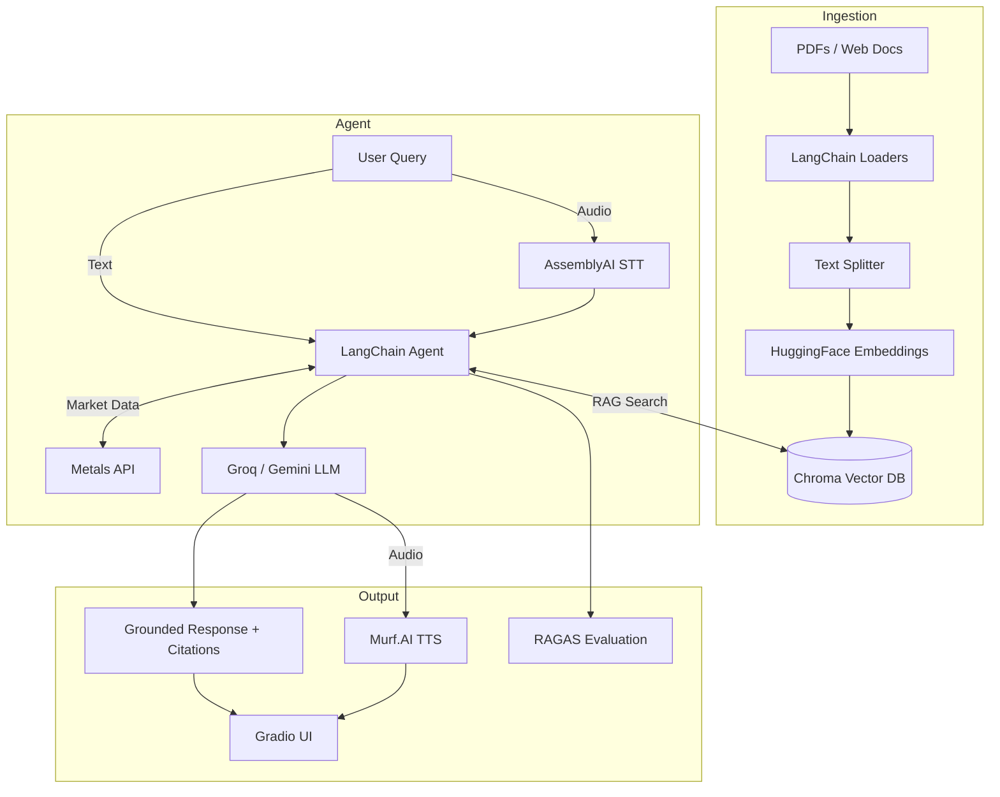

# AI Agents - RAG-Powered Intelligent Assistants

A collection of Retrieval-Augmented Generation (RAG) agents and AI-powered advisors built for real-world use cases including Indian tax advisory, personal finance consulting, research paper Q&A, and live web documentation analysis.

---

## Table of Contents

- [Overview](#overview)
- [Agents](#agents)
  - [Personal Tax AI Advisor](#1-personal-tax-ai-advisor)
  - [Voice-Enabled Finance Advisor](#2-voice-enabled-finance-advisor)
  - [PDF Research Paper RAG](#3-pdf-research-paper-rag)
  - [Web Documentation RAG](#4-web-documentation-rag)
- [Architecture](#architecture)
- [Evaluation](#evaluation)
- [Project Structure](#project-structure)
- [Tech Stack](#tech-stack)
- [Getting Started](#getting-started)
  - [Google Colab Setup](#google-colab-setup)
  - [Running Locally as Python Scripts](#running-locally-as-python-scripts)
- [Contributing](#contributing)

---

## Overview

Each agent in this repository follows a consistent RAG pipeline:

1. **Ingest** documents (PDFs, web pages) using LangChain loaders
2. **Chunk** text with recursive character splitting
3. **Embed** chunks using HuggingFace (`all-MiniLM-L6-v2`)
4. **Store** vectors in a Chroma database
5. **Query** with an LLM-powered agent that retrieves relevant context before generating grounded answers

Multi-provider LLM support includes **Groq** (`llama-3.3-70b-versatile`) and **Google Gemini** (`gemini-2.5-flash`), with optional voice interaction via AssemblyAI and Murf.AI.

---

## Agents

### 1. Personal Tax AI Advisor

**Notebook:** `Personal tax Advisor/Personal_Tax_AI_Advisor.ipynb`

An AI agent that answers complex Indian income tax queries with source-backed responses.

**Capabilities:**
- Old vs. New Tax Regime comparison
- Section 80C/80D deduction guidance
- ITR form selection (ITR-1 through ITR-7)
- Filing rules, deadlines, and penalties

**Data Sources:** CBDT ITR-4 Validation Rules, CBDT FAQ PDFs, SEBI Financial Education Booklet

**Model:** Groq Llama-3.3-70B | **Interface:** Gradio Web UI

---

### 2. Voice-Enabled Finance Advisor

**Notebook:** `Personal_finance_advicer (5).ipynb`

A voice-interactive financial advisor that provides guidance on GST rates, savings instruments, and real-time gold/silver prices in INR.

**Capabilities:**
- Voice input (speech-to-text via AssemblyAI)
- Audio response generation (text-to-speech via Murf.AI)
- Live metals market price lookup
- GST and savings guidance from official documents

**Data Sources:** SEBI Financial Booklet, CBIC GST Ready Reckoner, Live Metals API

**Model:** Google Gemini 2.5 Flash | **Interface:** Gradio Voice & Text UI

---

### 3. PDF Research Paper RAG

**Notebook:** `RAG.ipynb`

A straightforward RAG agent for grounded Q&A over research papers. Retrieves relevant passages and generates answers with exact metadata citations.

**Example Use Case:** Q&A over the *Attention Is All You Need* paper

**Model:** Google Gemini 2.5 Flash | **Output:** Text with source citations

---

### 4. Web Documentation RAG

**Notebook:** `docuchat_with_webdocs (3).ipynb`

Crawls and indexes live developer documentation pages, then answers technical questions grounded in the indexed content.

**Loader:** `WebBaseLoader` (BeautifulSoup4) | **Retrieval:** Chroma (k=6)

**Model:** Google Gemini 2.5 Flash | **Output:** Formatted Markdown

---

## Architecture



---

## Evaluation

Both advisor notebooks include automated RAG quality evaluation using the **RAGAS** framework:

| Metric | What It Measures |
| :--- | :--- |
| **Faithfulness** | Whether the answer is grounded in retrieved context (no hallucination) |
| **Answer Relevancy** | How directly the answer addresses the user's question |
| **Context Precision** | Signal-to-noise ratio in retrieved chunks |
| **Context Recall** | Whether all necessary context was successfully retrieved |

---

## Project Structure

```
AI-Agents/
├── Personal tax Advisor/
│   ├── CBDT_e-Filing_ITR 4_Validation Rules_AY 2026-27.pdf
│   ├── Common ITR Filing FAQs AY 2024-25.pdf
│   ├── Financial Education Booklet - English.pdf
│   ├── ITR-7_FAQ_AY_2024-25.pdf
│   ├── New vs. Old Regime FAQs approved final.pdf
│   └── Personal_Tax_AI_Advisor.ipynb
├── Personal_finance_advicer (5).ipynb
├── RAG.ipynb
├── docuchat_with_webdocs (3).ipynb
└── README.md
```

---

## Tech Stack

| Category | Tools |
| :--- | :--- |
| LLMs | Groq (`llama-3.3-70b-versatile`), Google Gemini (`gemini-2.5-flash`) |
| Framework | LangChain, LangGraph |
| Embeddings | HuggingFace `all-MiniLM-L6-v2` via `sentence-transformers` |
| Vector Store | Chroma |
| Document Loaders | `PyPDFLoader`, `WebBaseLoader` (BeautifulSoup4) |
| Voice | AssemblyAI (STT), Murf.AI (TTS) |
| Evaluation | RAGAS |
| Interface | Gradio |

---

## Getting Started

### Google Colab Setup

These notebooks are designed to run in **Google Colab**.

**Step 1:** Open Colab's Secrets panel and add the following API keys:

| Secret Name | Source | Required By |
| :--- | :--- | :--- |
| `GROQ_API_KEY` | [Groq Console](https://console.groq.com/) | Tax Advisor |
| `gemini_api_key` | [Google AI Studio](https://aistudio.google.com/) | All notebooks |
| `ASSEMBLYAI_API_KEY` | [AssemblyAI](https://www.assemblyai.com/) | Finance Advisor |
| `MURF_API_KEY` | [Murf.AI](https://murf.ai/) | Finance Advisor |

Enable **Notebook access** for each secret.

**Step 2:** Run cells sequentially. Each notebook handles its own dependency installation, document loading, vector store creation, and UI launch.

---

### Running Locally as Python Scripts

To run outside of Colab, make these adjustments:

**Install dependencies:**

```bash
pip install langchain langchain-community langchain-huggingface langchain-chroma \
    langchain-groq langchain-google-genai sentence-transformers pypdf \
    beautifulsoup4 gradio assemblyai ragas python-dotenv requests
```

**Replace Colab secrets with environment variables:**

```python
import os
from dotenv import load_dotenv

load_dotenv()

groq_api_key = os.getenv("GROQ_API_KEY")
gemini_api_key = os.getenv("GEMINI_API_KEY")
assemblyai_key = os.getenv("ASSEMBLYAI_API_KEY")
murf_key = os.getenv("MURF_API_KEY")
```

**Other changes:**
- Update file paths from Colab format (`/content/drive/...`) to local relative paths (`./Personal tax Advisor/...`)
- Replace `display(Markdown(...))` with `print()`
- Wrap entry points in `if __name__ == "__main__":`

---

## Contributing

Contributions, issues, and feature requests are welcome. Feel free to open an issue or submit a pull request.
