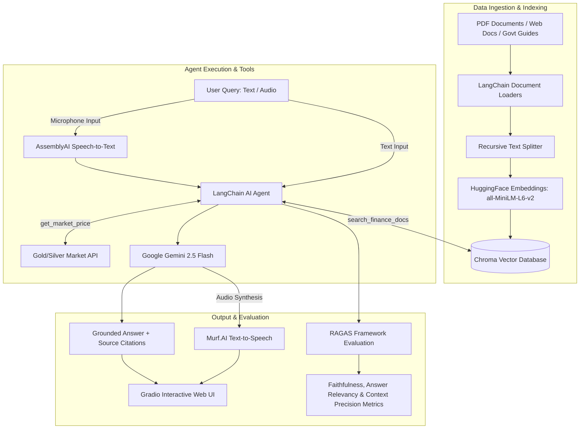

# RAG Agents & AI Advisors 🤖📚

A collection of Retrieval-Augmented Generation (RAG) agents and autonomous AI advisors built with **LangChain**, **HuggingFace Embeddings**, **Chroma Vector Database**, **Google Gemini** (`gemini-2.5-flash`), **AssemblyAI**, **Murf.AI**, **Gradio**, and **RAGAS Evaluation Framework**.

This repository contains notebooks for PDF Q&A, web documentation Q&A, and a voice-enabled personal finance advisor for Indian citizens with automated RAG pipeline evaluation.

---

## 🌟 Overview & Architecture

These agents use RAG pipelines, tool-calling agent architectures, and automated evaluation frameworks to ensure context-aware answers with source citations and quantitative quality metrics.



---

## 🤖 What the Agents Do

| Notebook | Agent Role & Description | Ingestion Source | Core Tools & Frameworks | Output Interface |
| :--- | :--- | :--- | :--- | :--- |
| **`Personal_finance_advicer (5).ipynb`** | **Voice-Enabled Personal Finance Advisor & RAGAS Evaluator** <br> Answers questions on Indian tax rules, GST rates, financial guidance, and live gold/silver prices. Includes automated RAG evaluation using RAGAS. | Official Indian Govt PDFs (SEBI, CBIC GST) & Live APIs | `search_finance_docs` (Chroma RAG), `get_market_price` (Gold/Silver API), AssemblyAI (STT), Murf.AI (TTS), RAGAS Framework | Gradio Web UI (Voice & Text) + RAGAS Metric Reports |
| **`RAG.ipynb`** | **PDF Document RAG Agent** <br> Contextual Q&A agent grounded strictly in research papers or custom PDFs (e.g., *Attention Is All You Need*). | Local / Google Drive PDF files | `PyPDFLoader`, `RecursiveCharacterTextSplitter`, Similarity Search ($k=2$) | Text responses with document metadata |
| **`docuchat_with_webdocs (3).ipynb`** | **Web Documentation RAG Agent** <br> Crawls, indexes, and answers technical inquiries from live developer documentation pages. | Web URLs via `WebBaseLoader` (`BeautifulSoup4`) | Web scraping, Chroma indexing ($k=6$), grounded prompt constraint | Markdown formatted text responses |

---

## 📊 RAG Pipeline Evaluation (RAGAS)

The `Personal_finance_advicer (5).ipynb` notebook includes an evaluation section using **RAGAS (Retrieval Augmented Generation Assessment)**:

- **Faithfulness**: Measures whether the generated answer is grounded entirely in the retrieved context.
- **Answer Relevancy**: Assesses how directly the answer addresses the user's question.
- **Context Precision**: Evaluates whether the retrieved context chunks contain relevant signal over noise.
- **Context Recall**: Verifies if all ground-truth information required to answer the question was retrieved.

---

## 📁 Repository Structure

```text
RAG-Agents/
├── Personal_finance_advicer (5).ipynb # Voice AI Advisor + RAGAS Evaluation
├── RAG.ipynb                          # PDF Document RAG Agent
├── docuchat_with_webdocs (3).ipynb    # Web Documentation RAG Agent
└── README.md                          # Repository documentation & setup guide
```

---

## 🎓 Prerequisite Knowledge

- **Python Basics**: Functions, API interactions, environment management.
- **RAG Architecture**: Chunking strategies (`chunk_size`, `chunk_overlap`), embeddings, vector similarity search, and prompt design.
- **LangChain Ecosystem**:
  - Loaders: `PyPDFLoader`, `WebBaseLoader`
  - Text Splitters: `RecursiveCharacterTextSplitter`
  - Embeddings & Vector Stores: `HuggingFaceEmbeddings`, `Chroma`
  - Agents & Tools: `@tool` decorator, `create_agent`, `init_chat_model`
- **Speech Integration**: Speech-to-Text (AssemblyAI) and Text-to-Speech (Murf.AI Falcon model).
- **RAG Evaluation**: RAGAS metrics (`ragas.llms.LangchainLLMWrapper`, `ChatGoogleGenerativeAI`).
- **Web UI**: Interactive UI development with `Gradio`.

---

## 🚀 Setup & Execution Guide (Google Colab)

These notebooks are designed for **Google Colab**.

### Step 1: Set Up API Keys in Colab Secrets
Click the **Secrets** (🔑 icon) on the left sidebar in Google Colab and add:

| Secret Name | Purpose | Where to Get | Required For |
| :--- | :--- | :--- | :--- |
| `gemini_api_key` | Google Gemini LLM access | [Google AI Studio](https://aistudio.google.com/) | All notebooks |
| `ASSEMBLYAI_API_KEY` | Speech-to-Text Transcription | [AssemblyAI Dashboard](https://www.assemblyai.com/) | `Personal_finance_advicer (5).ipynb` |
| `MURF_API_KEY` | Text-to-Speech Synthesis | [Murf.AI API Portal](https://murf.ai/) | `Personal_finance_advicer (5).ipynb` |

*Ensure **Notebook access** is toggled ON for each key.*

### Step 2: Execute Notebooks
Open the notebook in Google Colab and run cells sequentially to install dependencies, ingest documents, build the vector store, launch Gradio, and run RAGAS evaluation.

---

## 🐍 Running as Python (`.py`) Scripts: Key Modifications

To convert these notebooks into standard `.py` scripts, only environmental and UI adjustments are needed:

### 1. Dependencies Setup
Remove `!pip install ...` lines and install packages via terminal:
```bash
pip install langchain langchain-community langchain-huggingface langchain-chroma langchain-google-genai sentence-transformers pypdf beautifulsoup4 gradio assemblyai ragas python-dotenv requests
```

### 2. Environment Variable Management
Replace `google.colab.userdata` with `python-dotenv`:

```python
import os
from dotenv import load_dotenv

load_dotenv()
api_key = os.getenv("GEMINI_API_KEY")
assemblyai_key = os.getenv("ASSEMBLYAI_API_KEY")
murf_key = os.getenv("MURF_API_KEY")
```

### 3. File Path & Display Adjustments
- Update `/content/drive/MyDrive/...` paths to local file paths (e.g., `./data/sample.pdf`).
- Replace `display(Markdown(...))` calls with standard `print()` statements.

### 4. Entry Point & Gradio Launch
Wrap script execution inside `if __name__ == "__main__":`:

```python
if __name__ == "__main__":
    demo.launch()
```

---

## 📜 Dependencies Summary

- **LLM & Agents**: `langchain`, `langchain-google-genai`
- **Document Ingestion**: `pypdf`, `beautifulsoup4`, `langchain-text-splitters`
- **Embeddings & Vector Database**: `sentence-transformers`, `langchain-huggingface`, `langchain-chroma`
- **Voice Capabilities**: `assemblyai`, `requests` (Murf.AI API)
- **Evaluation**: `ragas`
- **Interface**: `gradio`

---

## 🤝 Contributing

Contributions, bug reports, and feature requests are welcome! Feel free to open an issue or submit a pull request.
